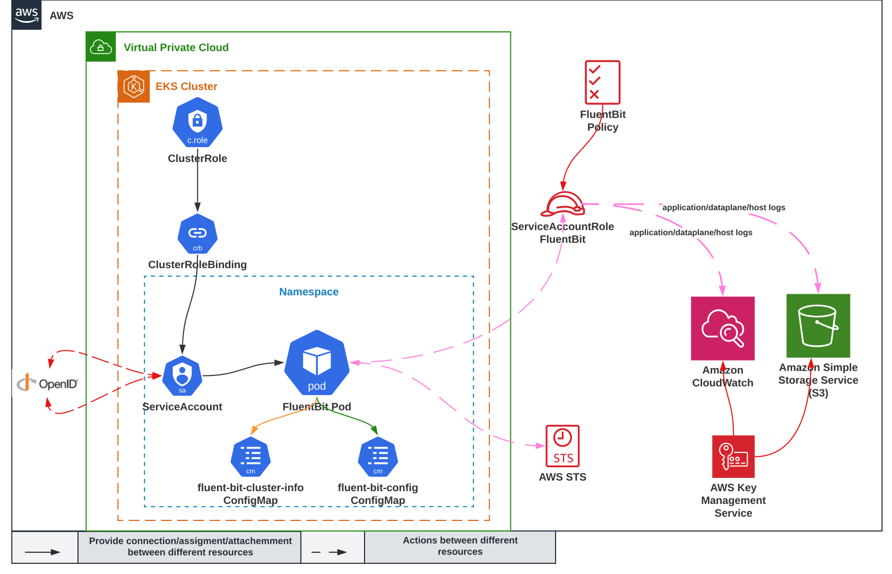

# EKS CloudWatch Inside with FluentBit Module

## Introduction

The `terraform-modules-eks-logging` module provides easy way to forward dataplane, application and host EKS logs to CloudWatch LogGroups, S3 Bucket or even to both in parallel.

- **Application logs:** All applications logs stored under “`/var/log/containers`" (This directory provides symbolic links to all the Kubernetes container logs in the `/var/log/pods` directory structure) are streamed into the dedicated `/aws/eks/containerinsights/Cluster_Name/application` log group. This captures your application container logs writing to stdout or stderr. It also includes logs for Kubernetes system containers such as aws-vpc-cni-init, kube-proxy, and coreDNS. All non-application logs such as kube-proxy and aws-node logs are excluded by default.


- **Host logs:** system logs for each EKS worker node are streamed into the `/aws/eks/containerinsights/Cluster_Name/host` log group. These system logs include the contents of “`/var/log/messages`,`/var/log/dmesg`,`/var/log/secure`” files. Considering the stateless and dynamic nature of containerized workloads, where EKS worker nodes are often being terminated during scaling activities, streaming those logs in real time with Fluent Bit and having those logs available in CloudWatch logs, even after the node is terminated, are critical in terms of observability and monitoring health of EKS worker nodes. It also enables you to debug or troubleshoot cluster issues without logging into worker nodes in many cases and analyze these logs in more systematic way.


- **Data plane logs:** EKS already provides control plane logs. With Fluent Bit integration in Container Insights, the logs generated by EKS data plane components, which run on every worker node and are responsible for maintaining running pods are captured as data plane logs. These logs which are stored at `/var/log/journal` (for kubelet.service, kubeproxy.service and docker.service) are also streamed into a dedicated CloudWatch log group under `/aws/eks/containerinsights/Cluster_Name/dataplane`. `kube-proxy`, `aws-node`, and Docker runtime logs are saved into this log group. In addition to control plane logs, having data plane logs stored in CloudWatch Logs helps to provide a complete picture of your EKS clusters.

Currently FluentBit does not support auto-creation of CloudWatch Groups with KMS key and that is the reason why we create the KMS and Log Groups separately in this code.
Check enhancement ticket https://github.com/aws/amazon-cloudwatch-logs-for-fluent-bit/issues/119 for more details.

Existing S3 Bucket could be used or module will create its own KMS key and S3 Bucket.
NOTE: When existing buckets are provided to the current module take in consideration to configure them correctly from security and best practice perspective.


## Module Usage Example

```hcl
  # Minimal Example to store logs in CloudWatch and S3
  module "eks_logging" {
    logs_destination_store = "both"
  }

  # Minimal Example to store logs in CloudWatch
  module "eks_logging" {
    logs_destination_store = "cloudwatch"
  }

  # Minimal Example to store logs in S3
  module "eks_logging" {
    logs_destination_store = "s3"
  }
  
  # Example with all possible variables that could be provided to the module
  module "eks_logging" {
    fluentbit_cluster_info_configs = {
      "logs.region"    = "us-east-1",
      "cluster.name"   = "eks-private-cluster",
      "http.server"    = "On",
      "http.port"      = "2020",
      "read.head"      = "Off",
      "read.tail"      = "On"
    }
    fluentbit_image                = "public.ecr.aws/aws-observability/aws-for-fluent-bit:stable"
    namespace_name                 = "amazon-cloudwatch"
    logs_destination_store         = "both"
    existing_s3_bucket_name        = "eks-log-bucket-123456789012"
    prefix_name                    = "fluent-bit"
    account_id                     = "123456789012"
  }
```
- Create a namespace for FluentBit
- Create Kubernetes ConfigMap with the major FluentBit configurations
- Create IAM role for the FluentBit Kubernetes Service Account with the needed IAM policies to allow usage of CloudWatch, KMS and S3 
- Create Kubernetes Service Account with the correct annotation to the AWS IAM Role for IRSA
- Create Kubernetes ClusterRole and ClusterRoleBindings with the appropriate permissions which FluentBit need and attach them to its Service Account
- If logs need to be forwarded to AWS CloudWatch separate LogGroup is created per log type (dataplane, application and host) and each has its own KMS key assigned to it
- If S3 bucket will be used as destination store for the logs it could be created by the module with KMS key assigned to it or existing bucket could be provided
- Separate Kubernetes ConfigMap is created for the actual INPUT/OUTPUT/FILTER/PARSER configuration of FluentBit
- FluentBit DaemonSet is created on the provided cluster


<!-- BEGIN_TF_DOCS -->
## Requirements

| Name | Version |
|------|---------|
| <a name="requirement_terraform"></a> [terraform](#requirement\_terraform) | >= 1.0.0 |
| <a name="requirement_aws"></a> [aws](#requirement\_aws) | >= 3.72 |
| <a name="requirement_kubernetes"></a> [kubernetes](#requirement\_kubernetes) | >= 2.10 |

## Providers

| Name | Version |
|------|---------|
| <a name="provider_aws"></a> [aws](#provider\_aws) | 4.19.0 |
| <a name="provider_kubernetes"></a> [kubernetes](#provider\_kubernetes) | 2.11.0 |

## Modules

| Name | Source | Version |
|------|--------|---------|
| <a name="module_fluentbit_cloudwatch_kms"></a> [fluentbit\_cloudwatch\_kms](#module\_fluentbit\_cloudwatch\_kms) | ../../../radoslav-byoi/resource_modules/identity/kms | n/a |
| <a name="module_fluentbit_s3_kms"></a> [fluentbit\_s3\_kms](#module\_fluentbit\_s3\_kms) | ../../../radoslav-byoi/resource_modules/identity/kms | n/a |

## Resources

| Name | Type |
|------|------|
| [aws_cloudwatch_log_group.fluentbit_log_group](https://registry.terraform.io/providers/hashicorp/aws/latest/docs/resources/cloudwatch_log_group) | resource |
| [aws_iam_policy.fluentbit_sa_irsa_cloudwatch_policy](https://registry.terraform.io/providers/hashicorp/aws/latest/docs/resources/iam_policy) | resource |
| [aws_iam_policy.fluentbit_sa_irsa_s3_policy](https://registry.terraform.io/providers/hashicorp/aws/latest/docs/resources/iam_policy) | resource |
| [aws_iam_role.fluentbit_sa_irsa](https://registry.terraform.io/providers/hashicorp/aws/latest/docs/resources/iam_role) | resource |
| [aws_iam_role_policy_attachment.fluentbit_sa_irsa_cloudwatch_attachment](https://registry.terraform.io/providers/hashicorp/aws/latest/docs/resources/iam_role_policy_attachment) | resource |
| [aws_iam_role_policy_attachment.fluentbit_sa_irsa_s3_attachment](https://registry.terraform.io/providers/hashicorp/aws/latest/docs/resources/iam_role_policy_attachment) | resource |
| [aws_s3_bucket.fluentbit_s3_eks_logs](https://registry.terraform.io/providers/hashicorp/aws/latest/docs/resources/s3_bucket) | resource |
| [aws_s3_bucket_acl.fluentbit_s3_eks_logs_acl](https://registry.terraform.io/providers/hashicorp/aws/latest/docs/resources/s3_bucket_acl) | resource |
| [aws_s3_bucket_lifecycle_configuration.fluentbit_s3_eks_logs_lifecycle_conf](https://registry.terraform.io/providers/hashicorp/aws/latest/docs/resources/s3_bucket_lifecycle_configuration) | resource |
| [aws_s3_bucket_policy.fluentbit_s3_eks_logs_policy](https://registry.terraform.io/providers/hashicorp/aws/latest/docs/resources/s3_bucket_policy) | resource |
| [aws_s3_bucket_public_access_block.fluentbit_s3_eks_logs_public_access_block](https://registry.terraform.io/providers/hashicorp/aws/latest/docs/resources/s3_bucket_public_access_block) | resource |
| [aws_s3_bucket_server_side_encryption_configuration.fluentbit_s3_eks_logs_sse](https://registry.terraform.io/providers/hashicorp/aws/latest/docs/resources/s3_bucket_server_side_encryption_configuration) | resource |
| [aws_s3_bucket_versioning.fluentbit_s3_eks_logs_versioning](https://registry.terraform.io/providers/hashicorp/aws/latest/docs/resources/s3_bucket_versioning) | resource |
| [kubernetes_cluster_role_binding_v1.fluentbit_rolebinding](https://registry.terraform.io/providers/hashicorp/kubernetes/latest/docs/resources/cluster_role_binding_v1) | resource |
| [kubernetes_cluster_role_v1.fluentbit_role](https://registry.terraform.io/providers/hashicorp/kubernetes/latest/docs/resources/cluster_role_v1) | resource |
| [kubernetes_config_map_v1.fluentbit_clusterinfo_cm](https://registry.terraform.io/providers/hashicorp/kubernetes/latest/docs/resources/config_map_v1) | resource |
| [kubernetes_config_map_v1.fluentbit_cm](https://registry.terraform.io/providers/hashicorp/kubernetes/latest/docs/resources/config_map_v1) | resource |
| [kubernetes_daemon_set_v1.fluentbit_daemonset](https://registry.terraform.io/providers/hashicorp/kubernetes/latest/docs/resources/daemon_set_v1) | resource |
| [kubernetes_namespace_v1.amazon_cloudwatch](https://registry.terraform.io/providers/hashicorp/kubernetes/latest/docs/resources/namespace_v1) | resource |
| [kubernetes_service_account_v1.fluentbit_sa](https://registry.terraform.io/providers/hashicorp/kubernetes/latest/docs/resources/service_account_v1) | resource |
| [aws_caller_identity.current](https://registry.terraform.io/providers/hashicorp/aws/latest/docs/data-sources/caller_identity) | data source |
| [aws_eks_cluster.eks_cluster](https://registry.terraform.io/providers/hashicorp/aws/latest/docs/data-sources/eks_cluster) | data source |
| [aws_eks_cluster_auth.eks_cluster](https://registry.terraform.io/providers/hashicorp/aws/latest/docs/data-sources/eks_cluster_auth) | data source |
| [aws_iam_policy_document.fluentbit_sa_irsa_log_to_cloudwatch](https://registry.terraform.io/providers/hashicorp/aws/latest/docs/data-sources/iam_policy_document) | data source |
| [aws_iam_policy_document.fluentbit_sa_irsa_log_to_s3](https://registry.terraform.io/providers/hashicorp/aws/latest/docs/data-sources/iam_policy_document) | data source |
| [aws_iam_policy_document.kms_log_to_cloudwatch](https://registry.terraform.io/providers/hashicorp/aws/latest/docs/data-sources/iam_policy_document) | data source |
| [aws_iam_policy_document.kms_log_to_s3](https://registry.terraform.io/providers/hashicorp/aws/latest/docs/data-sources/iam_policy_document) | data source |
| [aws_iam_policy_document.s3_bucket_policy_enable_tls](https://registry.terraform.io/providers/hashicorp/aws/latest/docs/data-sources/iam_policy_document) | data source |
| [aws_partition.current](https://registry.terraform.io/providers/hashicorp/aws/latest/docs/data-sources/partition) | data source |
| [aws_region.current](https://registry.terraform.io/providers/hashicorp/aws/latest/docs/data-sources/region) | data source |

## Inputs

| Name | Description | Type | Default | Required |
|------|-------------|------|---------|:--------:|
| <a name="input_account_id"></a> [account\_id](#input\_account\_id) | AWS Account ID | `string` | `null` | no |
| <a name="input_existing_s3_bucket_name"></a> [existing\_s3\_bucket\_name](#input\_existing\_s3\_bucket\_name) | Name of an existing S3 Bucket which will be used. If you use this S3 bucket must be created out side of this code and all the security consideration must be in place (for example encryption and so on). If this variable is not specified current code will create S3, KMS keys for them and will add the needed permissions | `string` | `null` | no |
| <a name="input_fluentbit_cluster_info_configs"></a> [fluentbit\_cluster\_info\_configs](#input\_fluentbit\_cluster\_info\_configs) | FluentBit major configuration settings | `map(string)` | <pre>{<br>  "cluster.name": "eks-ue1-uat-infra",<br>  "http.port": "2020",<br>  "http.server": "On",<br>  "logs.region": "us-east-1",<br>  "read.head": "Off",<br>  "read.tail": "On"<br>}</pre> | no |
| <a name="input_fluentbit_image"></a> [fluentbit\_image](#input\_fluentbit\_image) | FluentBit image which will be used for the DaemonSet deployment | `string` | `null` | no |
| <a name="input_logs_destination_store"></a> [logs\_destination\_store](#input\_logs\_destination\_store) | Destination where the EKS application/dataplane/host logs will be forwarded by FluentBit. Possible options are `cloudwatch`, `s3` or `both` of them. Default is `cloudwatch` | `string` | `"both"` | no |
| <a name="input_namespace_name"></a> [namespace\_name](#input\_namespace\_name) | Name of the namespace where the fluent-bit will be deployed | `string` | `"amazon-cloudwatch"` | no |
| <a name="input_prefix_name"></a> [prefix\_name](#input\_prefix\_name) | Prefix Name which will be used resource creation | `string` | `null` | no |

## Outputs

| Name | Description |
|------|-------------|
| <a name="output_cm_data"></a> [cm\_data](#output\_cm\_data) | n/a |
| <a name="output_env_from_configmap"></a> [env\_from\_configmap](#output\_env\_from\_configmap) | n/a |
| <a name="output_fluentbit_config_files"></a> [fluentbit\_config\_files](#output\_fluentbit\_config\_files) | n/a |
| <a name="output_fluentbit_configmap_configs"></a> [fluentbit\_configmap\_configs](#output\_fluentbit\_configmap\_configs) | n/a |
| <a name="output_kms_module"></a> [kms\_module](#output\_kms\_module) | n/a |
| <a name="output_kms_policy"></a> [kms\_policy](#output\_kms\_policy) | n/a |
| <a name="output_log_groups"></a> [log\_groups](#output\_log\_groups) | n/a |
| <a name="output_volume_mounts"></a> [volume\_mounts](#output\_volume\_mounts) | n/a |
<!-- END_TF_DOCS -->